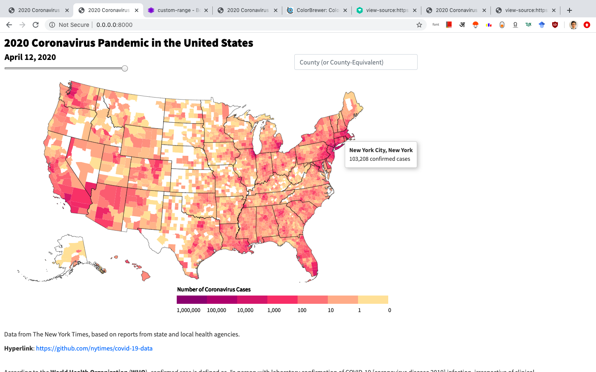
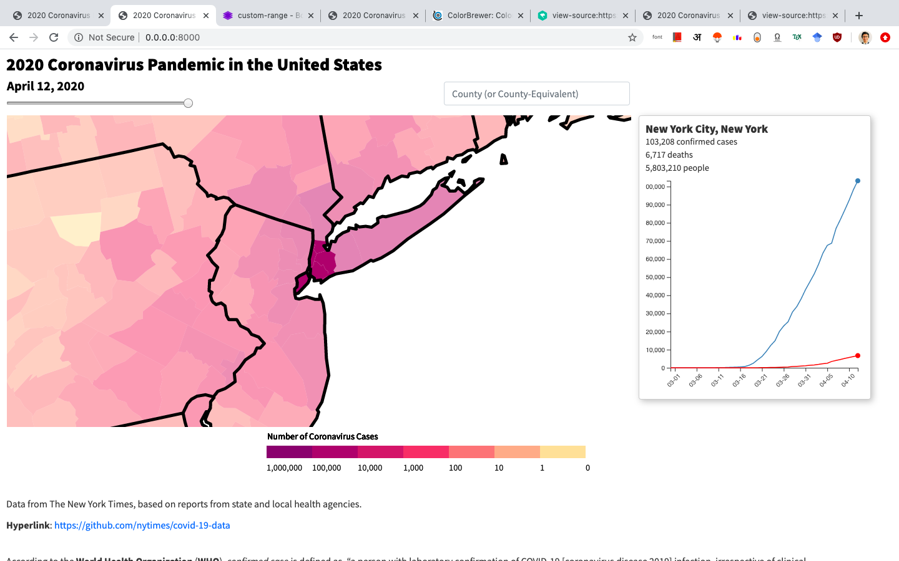

# COVID-19 Dashboard

This is a dashboard for coronavirus cases by county (and county-equivalent) in the United States, based on data from @nytimes/covid-19-data.

It is built using [D3.js](https://d3js.org/), a JavaScript library for making data-driven documents.





## Local development

```bash
$ git clone https://github.com/aryamanarora/coronavirus.git
$ cd coronavirus
$ python -m http.server
```

This opens the site at `http://localhost:8000/`.

## Features

* Choropleth map of cases on a logarithmic colour scale by U.S. county (and county-equivalent)
* Slider to see historical data
* Tooltip for number of cases and highlighting when hovering over a county
* Clicking on a county magnifies and focuses it, displaying an infobox to the right with case and death counts, and a graph of those over time
* Search bar to find a county or county-equivalent

